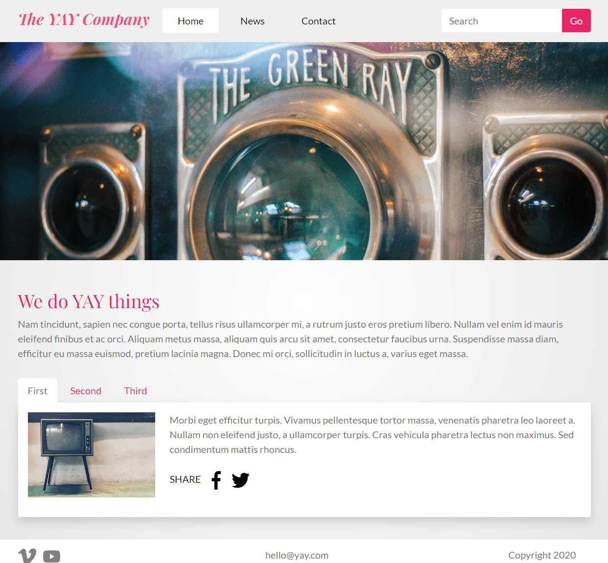

<div id="top"></div>

<!-- PROJECT LOGO -->
<br />
<div align="center">

  <h1 align="center">CSS Frameworks CA</h1>

  <p align="center">
    A React application with SASS.
    <br />
    <br />
    <a href="https://github.com/Noroff-FEU-Assignments/css-frameworks-ca-oysteinwangen/issues">Report Bug</a>
    ·
    <a href="https://github.com/Noroff-FEU-Assignments/css-frameworks-ca-oysteinwangen/issues">Request Feature</a>
  </p>
</div>


<!-- TABLE OF CONTENTS -->
<details>
  <summary>Table of Contents</summary>
  <ol>
    <li>
      <a href="#description">Description</a>
      <ul>
        <li><a href="#built-with">Built With</a></li>
      </ul>
    </li>
    <li>
      <a href="#getting-started">Getting Started</a>
      <ul>
        <li><a href="#installation">Installation</a></li>
        <li><a href="#running">Running</a></li>
      </ul>
    </li>
    <li>
      <a href="#usage">Usage</a>
    </li>
    <li><a href="#contributing">Contributing</a></li>
    <li><a href="#license">License</a></li>
    <li><a href="#contact">Contact</a></li>
  </ol>
</details>


<!-- DESCRIPTION -->
## Description



This is a feature project made to become familiar with the Bootstrap integration with React, also using SASS to extend and customize the Bootstrap-library.

**Features:**
* Hero image slider
* Search bar
* Basic UI
* Tabbed content
* Grid and pagination buttons
* Contact form

### Built With
* [React](https://reactjs.org/)
* [Bootstrap](https://react-bootstrap.github.io/)
* [Node Sass](https://www.npmjs.com/package/node-sass)

<p align="right">(<a href="#top">back to top</a>)</p>


<!-- GETTING STARTED -->
## Getting Started
### Installation

1. Clone the repo:
   ```sh
   git clone git@github.com:Noroff-FEU-Assignments/css-frameworks-ca-oysteinwangen.git
   ```
2. Install NPM packages:
   ```sh
   npm install
   ```
### Running

Run the following command to start developing:
```sh
npm run start
```

<p align="right">(<a href="#top">back to top</a>)</p>


<!-- USAGE -->
## Usage

Check out the documentation for [React](https://reactjs.org/docs/getting-started.html) and [React-Bootstrap](https://react-bootstrap.github.io/getting-started/introduction) to further extend this project.

<!-- CONTRIBUTING -->
## Contributing

Any contributions you make are **greatly appreciated!**

If you have a suggestion that would make this project better, please fork the repo and open a pull request. You can also simply open an [issue](https://github.com/Noroff-FEU-Assignments/css-frameworks-ca-oysteinwangen/issues) with the tag "suggestion".

1. Fork the Project
2. Create your Feature Branch (`git checkout -b feature/Suggestion`)
3. Commit your Changes (`git commit -m 'Add feature'`)
4. Push to the Branch (`git push origin feature/Suggestion`)
5. Open a Pull Request

<p align="right">(<a href="#top">back to top</a>)</p>


<!-- LICENSE -->
## License

Distributed under the MIT License. See `LICENSE` for more information.

<p align="right">(<a href="#top">back to top</a>)</p>


<!-- CONTACT -->
## Contact

Feel free to contact me on email - [hello@wangen.digital](mailto:hello@wangen.digital)

<p align="right">(<a href="#top">back to top</a>)</p>
